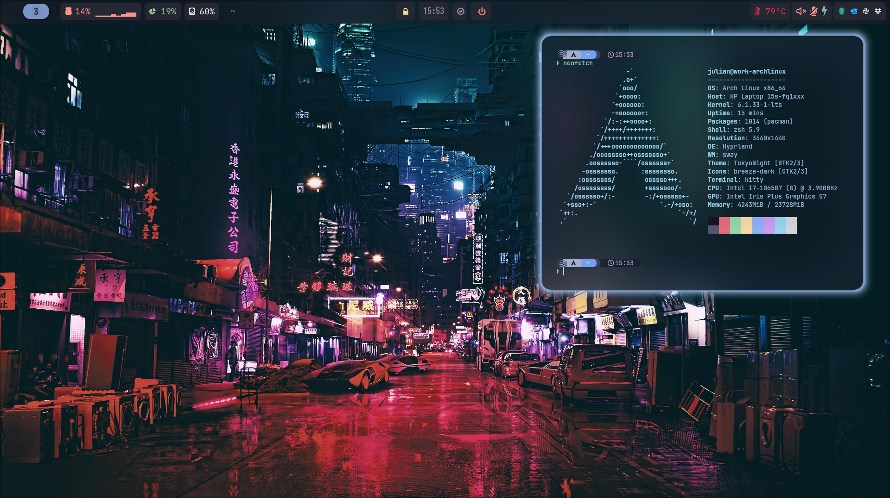

<div align="center">

# Dotfiles


My dotfiles for `arch-linux`. Managed by [`chezmoi`](https://github.com/twpayne/chezmoi).

[Deployment](#Deployement) • [Zsh](#zsh) •

<center>

</center>
</div>


## What is in this repo
This repository contains my personal configuration for Linux.

Here's the list of what is included in these dotfiles :
- [`Hyprland`](https://hyprland.org/) - Beautiful tiling Wayland compositor.
- [`zsh`](https://zsh.sourceforge.io/) - Interactive unix-like shell.
- And [many more](./home).

## Installation
* If using Bitwarden, login using :

  ```sh
  export BW_SESSION=$(bw login $BITWARDEN_EMAIL --raw)
  ```

* Deploy with shell one-liner:
    ```sh
    sh -c "$(curl -fsLS git.io/chezmoi)" -- init --apply julian-poidevin
    ```

## Keybinds

### General

| Keybind                                            | Description                                   |
| -------------------------------------------------- | --------------------------------------------- |
| <kbd>SUPER</kbd> + <kbd>T</kbd>                    | Open Kitty terminal                           |

### Special Keys

| Keybind                    | Description                 |
| -------------------------- | --------------------------- |
| <kbd>Volume Up</kbd>       | Increase volume by 5%       |
| <kbd>Volume Down</kbd>     | Decrease volume by 5%       |
| <kbd>Mute</kbd>            | Toggle mute                 |
| <kbd>Brightness Up</kbd>   | Increase brightness by 2%   |
| <kbd>Brightness Down</kbd> | Decrease brightness by 2%   |

---
## Credits
Thanks to the following individuals for their contributions to this project:
- [twpayne](https://github.com/twpayne) for providing such a great tool as [chezmoi](https://github.com/twpayne/chezmoi)
- [felipecrs](https://github.com/felipecrs) for his [dotfiles repository](https://github.com/felipecrs/dotfiles) which served as a valuable reference for this project.
- [rototrash](https://github.com/rototrash) for his nice [tokyo-night-sddm](https://github.com/rototrash/tokyo-night-sddm) `sddm` theme.